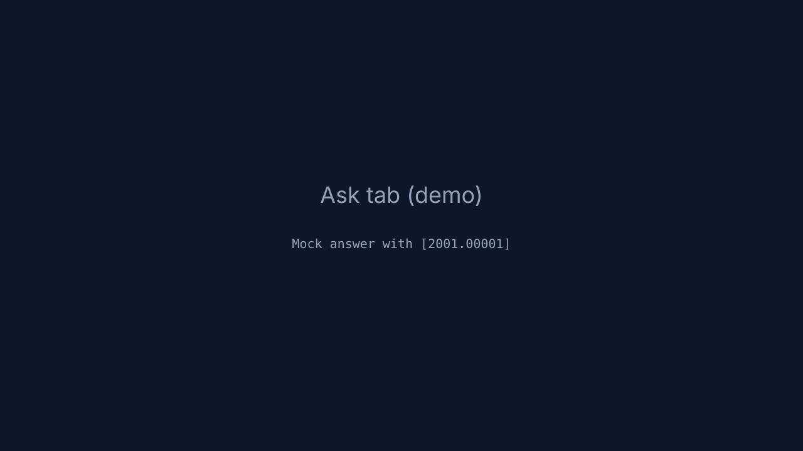
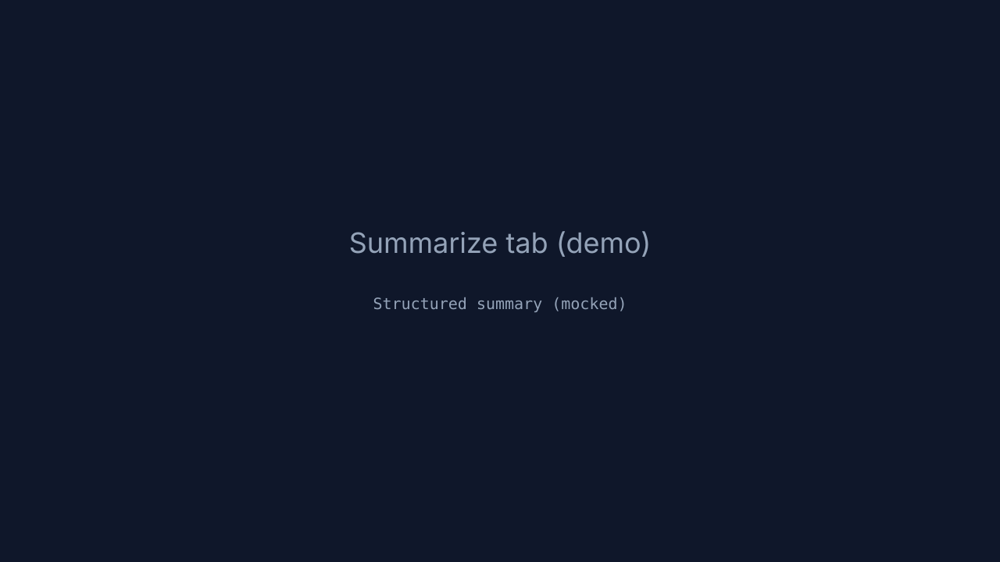
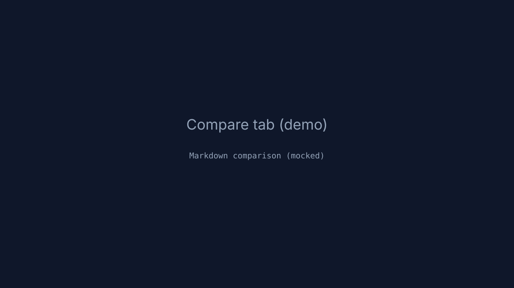

@@
- [Live Demo](your-deployed-url-here)
+ [Live Demo](your-deployed-url-here)
@@
- ## Screenshots
-
- 
- 
- 
+ ## Screenshots
+
+ 
+ 
+ 
@@
- # 3. Configure your API key (never commit this file)
- cp .env.example .env
- # edit .env and set GOOGLE_API_KEY — get a free key at
- # https://aistudio.google.com/app/apikey
+ # 3. Configure your API key (never commit this file)
+ cp .env.example .env
+ # edit .env and set GOOGLE_API_KEY — get a free key at
+ # https://aistudio.google.com/app/apikey
+ #
+ # Demo mode: by default the project runs in a mock-LLM demo mode that does
+ # NOT require a Gemini API key (useful for public demos). To enable the
+ # real Gemini API, set MOCK_LLM=false and provide GOOGLE_API_KEY in the
+ # environment of your deployment host (do NOT commit keys into the repo).
@@
- # 7. Start the backend API
- uvicorn backend.api:app --reload --port 8000
+ # 7. Start the backend API
+ uvicorn backend.api:app --reload --port 8000
@@
- # 8. In a separate terminal, start the frontend
- streamlit run app.py
+ # 8. In a separate terminal, start the frontend
+ streamlit run app.py
@@
- ## Deployment
+ ## Deployment
@@
- 3. Set the `GOOGLE_API_KEY` environment variable in the platform's dashboard —
-    never in code.
+ 3. Set the `GOOGLE_API_KEY` environment variable in the platform's dashboard —
+    never in code. If you want the public demo to work without a Gemini key,
+    you can leave the default mock LLM enabled (MOCK_LLM=true). To use the
+    real Gemini model in production, set MOCK_LLM=false and configure
+    GOOGLE_API_KEY as a secret in your hosting platform.
