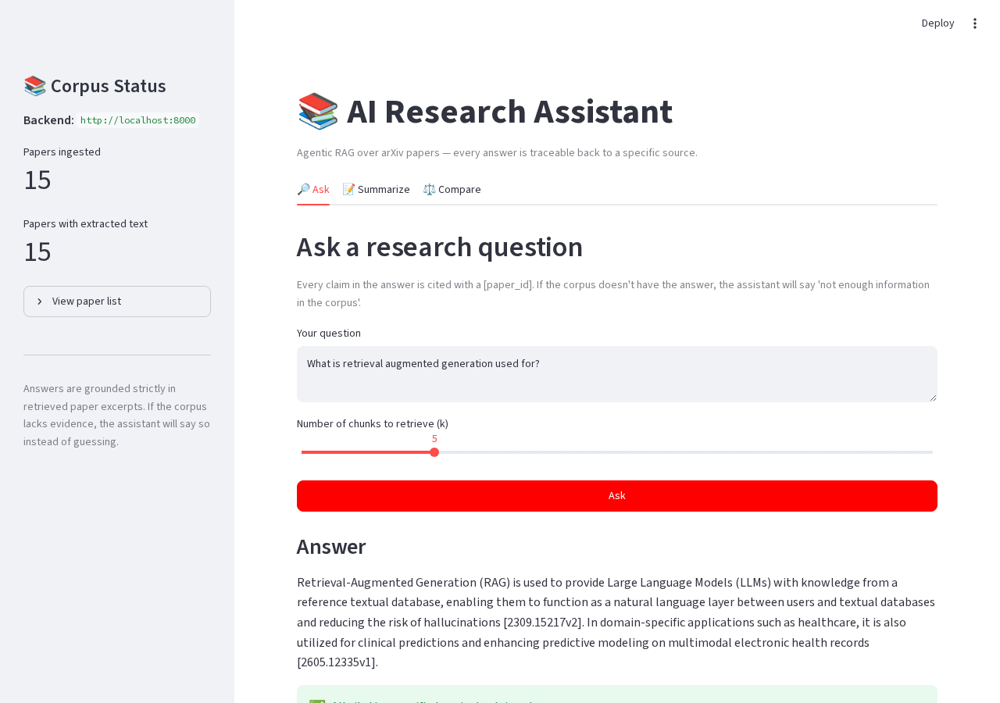
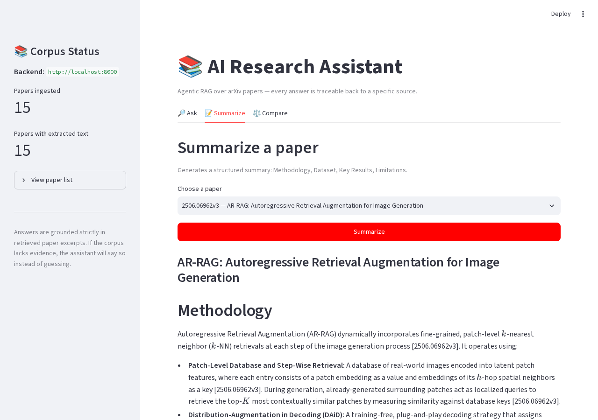
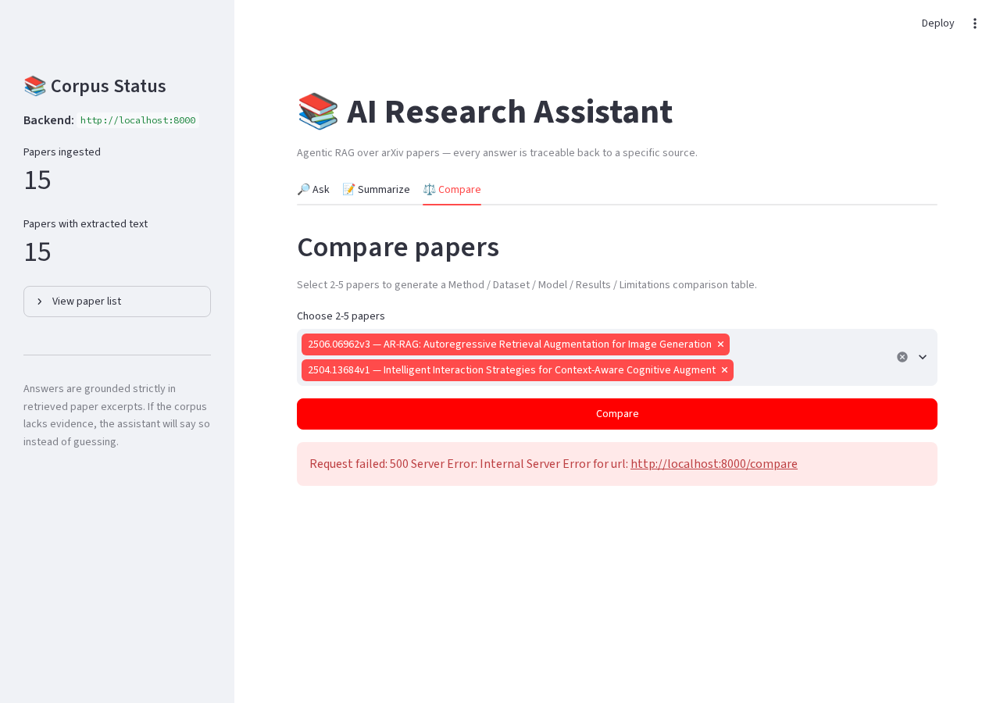

# 🔬 AI Research Assistant

### About

Ever asked a chatbot a research question and gotten a confident, plausible-sounding
answer that turned out to be wrong? That's the core problem with generic AI chatbots —
they're built to sound right, not to *be* right. **AI Research Assistant** is a system
that searches real academic papers on arXiv, reads them, and answers your questions
using only what those papers actually say — with a citation next to every claim, linking
straight back to the source. If the papers it found don't actually answer your question,
it tells you that instead of making something up. Think of it as a research assistant
that shows its work every single time.

---

## Problem

Researchers waste enormous amounts of time manually searching, reading, and
cross-referencing dozens of papers to answer a single question. Meanwhile, generic
LLM chatbots make this worse in a subtle way: they answer *confidently* even when they
don't actually know something, quietly fabricating plausible-sounding facts, numbers,
and citations (hallucination). Neither problem is solved by "just add an LLM" — you need
retrieval grounded in real sources, and a generation layer that is forced to stay
honest about what it does and doesn't know.

## Solution

This project builds a full agentic RAG (Retrieval-Augmented Generation) pipeline that:

1. Searches arXiv for real papers on a topic and downloads their PDFs.
2. Extracts and chunks the text, tagging every chunk with its source paper.
3. Embeds chunks into a FAISS vector index for fast semantic search.
4. Retrieves the most relevant chunks for a user's question.
5. Forces the LLM to answer **only** from those retrieved chunks, citing `[paper_id]`
   for every claim — and explicitly saying "not enough information in the corpus"
   when the evidence is too weak to answer confidently.
6. Verifies that every citation in the generated answer actually maps back to a
   retrieved source, flagging anything that doesn't.

## Architecture

```
User Query → arXiv Search → Paper Retrieval → PDF Download
  → Text Extraction → Chunking (with metadata) → Embedding Generation
  → FAISS Vector Store → Semantic Retrieval → LLM Generation
  → Citation Verification → Answer with Sources
```

| Stage | Implementation |
|---|---|
| arXiv Search | `arxiv` Python package, queries the public arXiv API |
| PDF Download | `arxiv` package downloader + exponential-backoff retry |
| Text Extraction | `pypdf`, page-by-page with per-page failure isolation |
| Chunking | Sliding window, ~800 chars / ~150 char overlap, tagged with `paper_id`, `title`, `authors`, `source_url` |
| Embeddings | `sentence-transformers` (`all-MiniLM-L6-v2`) |
| Vector Store | FAISS `IndexFlatIP` over L2-normalized vectors (cosine similarity) |
| Generation | Google Gemini (`gemini-flash-lite-latest`) via `google-generativeai` (REST transport) |
| Citation Verification | Regex-based check that every `[paper_id]` in the answer matches a retrieved chunk |

## Features

- **arXiv search** — query the arXiv API and get title, authors, abstract, published
  date, PDF URL, and arXiv ID for every result.
- **PDF ingestion** — downloads PDFs and extracts clean text; a failed download or
  extraction is logged and skipped, never crashes the pipeline.
- **Sliding-window chunking** — ~800 characters with ~150 character overlap; every
  chunk carries `paper_id`, `title`, `authors`, and `source_url` for citation.
- **Semantic retrieval** — `sentence-transformers` embeddings + FAISS `IndexFlatIP`
  cosine-similarity search.
- **Citation-grounded RAG QA** — the LLM answers *only* from retrieved chunks, cites
  `[paper_id]` for every claim, and explicitly declines ("not enough information in
  the corpus") rather than guessing.
- **Paper summarization** — structured per-paper summary: Methodology, Dataset, Key
  Results, Limitations.
- **Paper comparison** — markdown comparison table across 2-5 papers: Method /
  Dataset / Model / Results / Limitations.
- **Evaluation harness** — runs a labeled 40-question set against the retriever and
  reports Recall@5 and average retrieval latency to a JSON file.
- **Production hardening** — retry/backoff on network calls, structured logging,
  Pydantic input validation, in-memory response caching + rate limiting on `/ask`,
  Docker + CI, and a full pytest suite with mocked LLM calls. The Gemini client is
  pinned to `transport="rest"` (avoids gRPC connectivity issues in restricted network
  environments) and to the `gemini-flash-lite-latest` model alias (a fast, generously
  quota'd free-tier model, confirmed working end-to-end).

## Tech Stack

- **Python 3.11+**
- **FastAPI** — backend API
- **Streamlit** — demo frontend
- **sentence-transformers** (`all-MiniLM-L6-v2`) — embeddings
- **faiss-cpu** (`IndexFlatIP`) — vector index
- **arxiv** — search & PDF download
- **pypdf** — text extraction
- **Google Gemini API** (`google-generativeai`, `gemini-flash-lite-latest`, REST transport) — generation

## Live Demo

[Live Demo (GitHub Pages)](https://sumitjhadev.github.io/ai-research-assistant/)

The live demo above is the static marketing/overview landing page
(`landing/index.html`), hosted for free on **GitHub Pages** directly from this
repository (Settings → Pages → source: `main` branch, `/landing` folder — no
build step, Tailwind loaded via CDN). It showcases the pipeline, features, and
real screenshots below.

> **Note:** GitHub Pages only serves static files. The interactive Streamlit
> app (Ask / Summarize / Compare) needs a persistent Python process and must be
> run locally (see Quickstart) or deployed to a platform that supports long-running
> servers (Render, Railway, Streamlit Community Cloud — see **Deployment** below).
> The landing page's "Live Demo" button links here; wire it up to a hosted backend
> URL if/when you deploy one.

## Screenshots





## Quickstart

```bash
# 1. Clone and enter the project
git clone https://github.com/sumitjhadev/ai-research-assistant.git
cd ai-research-assistant

# 2. Create a virtual environment and install dependencies
python3.11 -m venv venv
source venv/bin/activate          # Windows: venv\Scripts\activate
pip install -r requirements.txt

# 3. Configure your API key (never commit this file)
cp .env.example .env
# edit .env and set GOOGLE_API_KEY — get a free key at
# https://aistudio.google.com/app/apikey

# 4. Ingest a real arXiv corpus (default topic: "retrieval augmented generation")
python backend/ingest.py --query "retrieval augmented generation" --max-results 50

# 5. Build the FAISS vector store
python backend/vectorstore.py build

# 6. (optional) Try a raw retrieval search from the CLI
python backend/vectorstore.py search "what datasets were used" --k 5

# 7. Start the backend API
uvicorn backend.api:app --reload --port 8000

# 8. In a separate terminal, start the frontend
streamlit run app.py
```

Then open the Streamlit URL printed in your terminal (usually
`http://localhost:8501`) and try the **Ask**, **Summarize**, and **Compare** tabs.

### Run with Docker instead

```bash
cp .env.example .env   # fill in GOOGLE_API_KEY
docker compose up --build
# backend:  http://localhost:8000
# frontend: http://localhost:8501
```

Note: you still need to run ingestion + vector store build once (either locally
before building the image, or via `docker compose exec backend python backend/ingest.py ...`)
since the corpus is not baked into the image.

## Evaluation

The evaluation harness runs the labeled question set in
`data/research_questions.json` (40 questions across retrieval/method, dataset,
results/metrics, and limitations/future-work categories) against the FAISS
retriever and computes:

- **Recall@5** — fraction of labeled questions where at least one expected source
  paper appears in the top-5 retrieved chunks.
- **Average / p95 retrieval latency** — wall-clock time per query.

```bash
python tests/evaluate.py
python tests/evaluate.py --k 5 --questions data/research_questions.json
```

Results are written to `tests/eval_results.json`.

> **Note:** `expected_sources` in `data/research_questions.json` ships empty by
> design — only a human who has inspected the actual ingested corpus can verify
> true ground truth. Fill these in yourself after running ingestion before Recall@5
> becomes meaningful; until then the script reports latency only and flags how many
> questions are still unlabeled.

## Results

> Fill in after running `python tests/evaluate.py` on your own ingested corpus.

| Metric | Value |
|---|---|
| Corpus size (papers) | _TBD_ |
| Total chunks | _TBD_ |
| Recall@5 | _TBD_ |
| Avg retrieval latency | _TBD_ |
| p95 retrieval latency | _TBD_ |

## Deployment

**Backend (Render / Railway):**
1. Push this repo to GitHub.
2. Create a new Web Service pointing at the repo, using the included `Dockerfile`
   (or `uvicorn backend.api:app --host 0.0.0.0 --port $PORT` as the start command).
3. Set the `GOOGLE_API_KEY` environment variable in the platform's dashboard —
   never in code.
4. Ingest the corpus and build the vector store either as a one-off release job or
   by mounting a persistent volume for `data/corpus/`.

**Frontend (Streamlit Community Cloud):**
1. Connect your GitHub repo at [share.streamlit.io](https://share.streamlit.io).
2. Set the main file to `app.py`.
3. Add a `BACKEND_URL` secret pointing at your deployed backend's public URL.
4. Deploy — Streamlit Community Cloud builds from `requirements.txt` automatically.

## Project Structure

```
research-agent/
├── backend/
│   ├── config.py       # paths, model names, env vars, structured logging
│   ├── ingest.py       # arXiv search + PDF download + chunking, CLI entrypoint
│   ├── vectorstore.py  # embedding + FAISS build/search, CLI entrypoint
│   ├── rag.py          # ask() / summarize_paper() / compare_papers()
│   └── api.py          # FastAPI app exposing /ask /summarize /compare /papers
├── app.py                 # Streamlit UI with tabs: Ask / Summarize / Compare
├── tests/
│   ├── evaluate.py        # Recall@5 + latency evaluation script
│   ├── test_ingest.py     # chunker unit tests
│   ├── test_vectorstore.py# retriever unit tests
│   ├── test_rag.py        # citation-grounding unit tests
│   └── test_api.py        # FastAPI endpoint unit tests (mocked LLM)
├── data/
│   ├── research_questions.json   # 40-question eval set
│   └── sample_topics.md          # alternative arXiv queries
├── landing/
│   ├── index.html                 # static marketing/overview landing page
│   └── README.md                  # how to configure links + deploy it
├── .github/workflows/ci.yml      # pytest + ruff on every push
├── screenshots/                   # drop your own screenshots here
├── Dockerfile
├── docker-compose.yml
├── requirements.txt
├── requirements-dev.txt
├── .env.example
├── LICENSE
├── CONTRIBUTING.md
└── README.md
```

## Future Work

- Add re-ranking (e.g. cross-encoder) after initial FAISS retrieval to improve
  precision on ambiguous queries.
- Support multi-hop questions that require combining evidence from several papers.
- Add streaming responses in the Streamlit UI for faster perceived latency.
- Persist the FAISS index in a managed vector DB (e.g. Pinecone, Qdrant) for
  multi-instance deployments instead of a local file.
- Add a feedback loop where user-flagged bad citations retrain a re-ranker.
- Expand the evaluation harness with a Precision@k and MRR metric alongside Recall@5.
